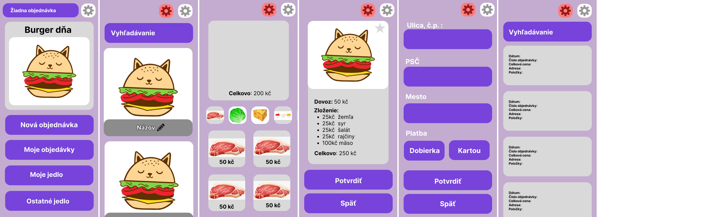

# Návrhy témat

## Webová aplikácia pre EDR (Endpoint Detection and Response)

Navrhol: Matúš Hubinský

EDR systémy analyzujú chovania viacerých zariadení a vyhodnocujú bezpečnostné hrozby na základe udalostí zaznamenaných v databáze. Ak vyhodnotia chovanie ako nebezpečné vygenerujú alert. Tento alert je následne spracovaný bezpečnostným analytikom, ktorý sa venuje monitoringu. Bezpečnostný analytici môžu naraz monitorovať viaceré systémov a preto potrebujú také grafické rozhranie, z ktorého vedia na prvý pohľad určiť počet nových bezpečnostných upozornení a zároveň ich závažnosť. Existuje viacero riešení, ale každé má svoje problémy a dalo by sa vylepšiť.

## Mobilná aplikácia pre BAM (Brnenský Architektonický Manuál)

Navrhol: Martin Otradovec

BAM je projekt poskytujúci databázu architektonicky významných objektov v Brne. Cielom realizácie bolo vytvoriť k už existujúcemu webu mobilnú aplikáciu poskytujúcu prístup k objektom, trasám a audios sprievodcom prívetivo a offline. Ďalším možným prvkom je skenovanie kódov, ktoré sú po Brne rozmiestnené pri budovách alebo detekcia budov v okolí podľa GPS. Aplikáciu by bolo možné v prípade kvalitnej realizácie ponúknuť BAMu pre reálne využitie, pripadne rozvinúť do bakalárskej práce. Záujem medzi užívateľmi existujúceho webu je nezanedbateľný. Podobná aplikácia existuje vo forme postaršej bakalárskej práce, ale nie je verejne prístupná.

## Mobilná aplikácia pre objednávanie a zostavanie hamburgerov - Food Blueprint

Navrhol: Marek Vandík

Aplikácia Food Blueprint má za cieľ umožniť svojim užívateľom nielen objednávať, ale rovno poskladať hamburger podľa preferencií užívateľov. Inšpiráciou pre toto téma sú hlavne samoobslužné systému v reštauráciách ako sú McDonald's, hamburger King apod. Bolo by zaujímavé, keby užívatelia aplikácie mohli sami vytvárať hamburgery podľa svojich predstáv (zostaviť hamburger z obľúbeného typu žemle, mäsa atp.) a boli by schopný medzi sebou svoje výtvory zdieľať. Funkcionalitu zostaviť hamburger síce predtým zmienené systémy umožňujú, ale nie je to ich hlavný zámer a napr. neponúkajú (z môjho predchádzajúceho prieskumu) alebo je moc zložité prehodiť poradie ingrediencií.

## Vybrané téma

Po hlasovaní a dohode sme vybrali aplikáciu pre objednávanie a zostavanie hamburgerov - Food Blueprint. Aplikácia je relatívne jednoduchá na realizáciu a zber dár pre prieskum užívateľských potrieb.

# Priekum

## Matúš

### Dotazník

Dotazník bol robený formou online a offline stretnutia. Na začatku boli respondentom prečítané otázky. Respondeti na ne následne odpovedali. Pri každej otázke vznikla krátka diskucia nad danou problematikou.

1. Používali ste niekedy aplikáciu na objednávanie jedla?
    * Možnosti: Áno/Nie
    * Cieľ otázky: Prefiltrovanie respondentov na vhodných a nevhodných pre náš prieskum
    * Zistenie: Všetci respondenti odpovedali áno a sú teda vhodný pre náš prieskum

2. Čo sa vám páčilo na ich GUI?
    * Možnosti: Páči sa mi ich vzhlad, na "dáme jídlo" sa mi nepáči úvodná stránka ktorá je moc chaotická
    * Cieľ otázky: Aké GUI je pre užívateľov najlepšie? Majú radi GUI ostatných aplikácií?
    * Zistenie: Aplikácie ktoré sú momentálne na trhu majú ideálne GUI pre užívateľov a 

3. Čo sa vám páčilo na ich dizajne?
    * Možnosti: Majú tak akurát myšlienok, ani veľa ani málo. / Sú prívetivé a nemajú veľa farieb.
    * Cieľ otázky: Aký dizajn aplikácií sa respondentom najviac páči?
    * Zistenie: Respondenti preferujú jednoduché aplikácie ktoré majú minimálnu paletu farieb.

4. Aký je pre vás najdôležitejší faktor pri výbere hamburgeru?
    * Možnosti: Ingrediencie, suroviny / Ingrediencie, zloženie
    * Cieľ otázky: Na základne čoho sa užívatelia rozhodujú pri výbere hamburgeru?
    * Zistenie: Užívateľom najviac záleží na surovinách, ingredienciách a zložení hamburgeru.

5. Ako by ste si predstavovali výber hamburgeru?
    * Možnosti: Chcem si vyberať suroviny / Základná šablóna ktorú neskôr do upravím
    * Cieľ otázky: Aký je pre užívateľov najlepší spôsob ako si vybrať svoj hamburger?
    * Zistenie: Užívatelia si chcú upraviť svoje hamburgeri, z toho vyplýva že, naša aplikácia má zmysel.

6. Sú pre vás možnosť prispôsobenia hamburgerov dostačujúce?
    * Odpovede: Nie. Málo vídam kuracie hamburgery. Kamarátka hovädzie nemá rada, takže sme nemohli ísť na hamburger / Nie, chcela by som vidieť niečo nové. 
    * Cieľ otázky: Zistenie či naša aplikácia má zmysel a či užívatelia chcú viac prispôsobiť ingrediencie v svojich hamburgeroch.
    * Zistenie: Respondenti majú potrebu prispôsobiť si svoj hamburger.

7. Sú pre vás aplikácie, ktoré sú momentálne na trhu, uspokojivé?
    * Možnosti: Áno/Nie
    * Cieľ otázky: Sú užívatelia spokojný s aplikáciami ktoré sú momentálne na trhu?
    * Zistenie: Respondenti odpovedali pol na pol. Nedá sa jednoznačne určiť či sú spokojný s aplikáciami ktoré sú momentálne na trhu.

8. Narazili ste na problém pri objednávaní hamburgeru?
    * Možnosti: Áno, chýbala mi možnosť výberu mäsa / Nikdy som neobjednavala hamburger
    * Cieľ otázky: Majú Respondenti problémy pri objednávaní hamburgerov? 
    * Zistenie: Užívatelia sa pri objednávaní hamburgerov stretávajú s problémami. Chcú upravovať zloženie hamburgerov.

9. Je nejaká špecifická funkcia ktorá podla vás chýba ostatným aplikáciam na jedlo?
    * Možnosti: Áno, chýba mi upravovanie jedla / Upravovanie surovín v hamburgery
    * Cieľ otázky: Potrebuje naša aplikácia novú funkciu, inú ako konkurenčné aplikácie na objednávanie jedla?
    * Zistenie: Respondenti majú záujem o aplikáciu ktorá by umožňovala detailne upravovať jedlo.

10. Aký typ užívateľského rozhrania vám príde najprívetivejší?
    * Možnosti: jednoduchý a minimalistický / farebný / vysoký kontrasty
    * Cieľ otázky: Aký vzhľad UI príde respondentom najprívetivejší?
    * Zistenie: Respondenti preferujú farebné, jednoduché a minimalistické aplikácie.

11. Aké prísady podla vás patria do hamburgeru?
    * Odpovede: hovädzie mäso, bravčové mäso, kuracie mäso, mix mäso, svetlá a tmavá žemľa, cheddar, hermelín, niva, šalát, rajčina, cibuľa, uhorky, olivy, majonéza, BBQ, chilli, volské oko
    * Cieľ otázky: Zistenie aké ingrediencie má naša aplikácia obsahovať.
    * Zistenie: Zoznam ingrediencií ktoré užívatelia chcú od našej aplikácie.

### Poznatky    

Všetci respondenti mali skúsenosti s používaním aplikácií na objednávanie jedlo. Respondenti si všímajú hlavne prehľadnosť aplikácie. Pri väčšine aplikácií majú problém s nedostatočnou možnosťou úpravy jedla. Niektoré aplikácie ponúkajú možnosť odstránenie ingrediencií položiek, ale nemajú možnosť pridania ingrediencií navyše. Taktiež je pre nich dôležité aby bolo hlavná stránka prehľadná a alebo na nej nič čo nepotrebujú.

#### Potreby užívateľov

- prehľadnosť aplikácie
- obrázky ingrediencií a jedál
- nevyžadovanie registrácie

#### Kľúčové problémy

- potreba upraviť si jedlo podla seba

### Porovnávanie s existujúcimi aplikáciami
- foodora

#### Prednosti

- rozdelovanie jedla podľa kategórií
- široká ponuka pred vytvorených jedál
- jednoduchá paleta farieb
- veľké obrázky s jedlami

#### Nedostatky

- nutnosť registrácie
- chýba možnosť úpravy jedál (pridávanie a odoberanie ingrediencií)

#### Inšpirácia a Riešenie nedostatkov

- naša aplikácia bude používať malú paletu farieb (maximálne 3 farby)
- nebudeme vyžadovať registráciu
- veľký dôraz na možnosť upravovania jedľa
- pred vytvorenie širokej ponuky hotových jedál

## Marek

### Dotazník

Siedmim užívateľom bol zaslaný nasledujúci dotazník a ďalej následne bola uskutočnená krátka diskusia nad odpoveďami a prípadnými nejasnosťami a ďalšími pripomienkami.

1. Uvítali by ste možnosť získať doporučenie na dobrý hamburger od ostatných užívateľov?
	* Možnosti: Áno/Nie
	* Cieľ otázky: Má užívateľ potrebu objednávať jedlo podľa ostatných užívateľov? - Relevancia modulu komunitného workshopu / zdielanie hamburgerov
	* Zistenie: 6/7 užívateľov považuje túto funkcionalitu ako užitočnú, vhodné pre zaradenie do projektu.

2. Keď navštevujete nejakú reštauráciu, máte pri vstupu jasno, čo konkrétne budete jesť?
	* Možnosti: Áno/Nie
	* Cieľ otázky: Potrebuje užívateľ najskôr vidieť vidieť prestavenie reštaurácie alebo priamo objednať? - Privítať užívateľa informáciami o reštaurácií / výberom jedál
	* Zistenie: Všetci respondenti vyberajú až na mieste - bolo by vhodné dôkladne predstaviť menu / možnosti

3. Privítali by ste možnosť uložiť si recept na dobrý hamburger, ktorý by ste si mohli jednoducho objednať v budúcnosti?
	* Možnosti: Áno/Nie
	* Cieľ otázky: Má užívateľ potrebu ukladať si obľúbené jedlá? - relevancia modulu pre ukladanie receptov
	* Zistenie: 3:4 časť užívateľov by modul pre ukladanie receptov využila, zrejme vhodné pre zaradenie do projektu

4. Ako často v reštauráciách ako je McDonald's alebo KFC uprednostníte objednávku pri samoobslužnom kiosku pred klasickou objednávkou na pokladne?
	* Možnosti: Vždy (takmer vždy) / Využívam obe možnosť / Len výnimočne, napr. ak je príliš dlhá rada / Vôbec
	* Cieľ otázky: Skúsenosti užívateľa s takýmito systémami - relevancia ďalších odpovedí zameraných konkrétnejšie na GUI
	* Zistenie: Všetci respondenti až na jediného respondenta, ktorý odpovedal "Len výnimočne", zvolili možnosť "Vždy / takmer vždy" - výsledok odpovedí na GUI bude rozdelený váhovo nasledujúcim spôsobom: Odpovedi respondentov, ktorý vybrali "Vždy / takmer vždy", budú mať váhu 1. Zostávajúci respondent bude mít váhu 0.5

5. Koľko približne ingrediencií je podľa vás ideálny počet v hamburgeru? (žemle sa nepočítajú)
	* Možnosti: 2 a menej / 3 - 5 / 6 a viac
	* Cieľ otázky: Prispôsobenie GUI pre najčastejší počet ingrediencií - veľkosť položiek
	* Zistenie: S váhou 3.5 možno predpokladať ako najčastejší počet položiek možnosť "6 a viac". možnosť "3 - 5" mala váhu 3, a zostávajúca možnosť "2 a menej" mala váhu 0

6. Stalo se vám niekedy, že ste v hamburgeru chceli mať nejakú ingredienciu viackrát / v inej vrstve hamburgeru?
	* Možnosti: Áno/Nie
	* Cieľ otázky: Potreba užívateľa menit zloženie hamburgeru. Spätne veľmi zbytočné - obsiahnuté v otázke 10, ale táto otázka pre zmenu zisťuje príčinu
	* Zistenie: 4:3 - Niektorý užívatelia túto funkcionalitu určite ocenia, práve vďaka skúsenostiam uvedených v otázke

7. Využili by ste možnosť zostaviť si hamburger z dopredu daných ingrediencií podľa vašich predstáv?
	* Možnosti: Áno/Nie
	* Cieľ otázky: Má užívateľ potrebu zostavovať vlastné hamburgery? - relevancia tejto aplikácie
	* Zistenie: 6:1 Väčšina užívateľov by takúto možnosť rada využila - táto aplikácia má zmysel

8. Prosím, zaraďte následujúce ingrediencie do skupín.
	* Možnosti: : rajčina, majonéza, slanina, hovädzie, tatárka, uhorka, tofu, chilli paprička, kuracie, šalát, kapusta, sójové mäso, horčica
	* Cieľ otázky: Ako užívatelia najčastejšie nazývajú rôzne kategórie ingrediencií - ako prezentovat ingrediencie
	* Zistenie: Užívatelia mali veľmi odlišné radenie do skupin, ale z odpovedí sa dá vypozorovat, že väčšina užívateľov zvolila kategorizáciu skôr na druhy jedál - omáčka, mäso, zelenina, prípadne vegán alebo špecialita pre tofu a chilli. Len minorita užívateľov volila odlišnejšie rozdelenie - po chodoch (hlavný - mäso, príloha - šalát atp.) alebo podľa toho, ako majú danú ingredienciu radi (najlepšie - mäso, dobré - rajčina atď.)

9. Prosím, zaraďte vymenované ingrediencie do uvedených kategórií. V prípade, že sa nedá ingredienciu logicky zaradiť, vymyslite vlastnú kategoriu.
	* Možnosti: rajčina, slanina, hovädzie, uhorka, tofu, chilli paprička, kuracie, šalát, kapusta, sójové mäso
	* Kategórie: mäso, zelenina
	* Cieľ otázky: ako 8) s zameraním na špecifické ingrediencie: slanina, chilli, tofu - nedá sa jednoznačne určiť, ako tieto ingrediencie kategorizovať + porovnávanie s 8)
	* Zistenie: Z výsledkov nedá sa jednoznačne určiť zaradenie spomínaných surovín. Pre slaninu časť ľudí zvolila kategoriu mäso, ale časť ľudom toto zaradenie nevyhovovalo a radšej vymysleli inú kategóriu ako napríklad špecialita alebo doplnok. Pre chilli väčšina ľudí zvolila kategóriu zelenina, ale stále sa našli respondenti, ktorý by preferovali špeciálne zaradenie mimo zeleninu opäť ako špecialita. U tofu bolo rozhodovanie najzložitejšie - objavili sa kategórie mäso, zelenina aj specialita, prípadne vegán (respondent, ktorý je vegán, uviedol, že mu najviac vyhovuje zaradenie špecialita)

10. Pri výbere dopredu zostaveného hamburgeru, uvítali by ste možnosť tento hamburger upravit?
	* Možnosti: Upravit / Ponechať bez úprav
	* Cieľ otázky: Potreba užívateľa meniť dopredu pripravené hamburgery
	* Zistenie: 6:1 užívateľov by uvítalo možnosť meniť zloženie dopredu zostavené hamburgery

11. Pri ukladaní Vašeho hamburgeru, priali by ste si, aby tento hamburger mohli vidieť aj ostatný užívatelia?
	* Možnosti: Uložiť viditelne pre všetkých / Uložiť len pre seba / Uprednostnil by som obe možnosti
	* Cieľ otázky: Má užívateľ potrebu svoj hamburger ukladať a zdielať ho?
	* Zistenie: 2:0:4 a "vôbec neukladať" - Väčšina užívateľov by uvítala túto možnosť vrátane rozlíšenia súkromných a verejných hamburgerov. Odpoveď "vôbec neukladať" je spôsobené zle formulovanou otázkou

12. Chceli by ste zostavovať hamburger pomocou tlačítiek pre pridávanie jednotlivých ingrediencií do určitej vrstvy, alebo radšej dotykovo presúvať ingrediencie z ponuky priamo do hamburgeru?
	* Možnosti: Tlačítka / Presúvať / Iné
	* Cieľ otázky: Aký spôsob zadávania ingrediencií je pre užívateľa najlepší?
	* Zistenie: 1:4.5:1 - Väčšina užívateľov by preferovala presúvanie ingrediencií priamo do hamburgeru

13. Čo chcete vidieť ako prvé, keď otvoríte aplikáciu pre objednanie jedla z konkrétnej reštaurácie?
	* Možnosti: Ponuku štandartných hamburgerov / Skladanie hamburgeru / Ponuku komunitných hamburgerov (odporúčanie hamburgerov od ostatných užívateľov) / Iné
	* Cieľ otázky: o má užívateľ za potrebu vidieť ako prvé?
	* Zistenie: 0.5:3:3.5 - užívatelia by preferovali ponuku komunitných hamburgerov alebo skladanie hamburgeru. Hodnotenie 0.5 z dôvodu výberu 2 pri jednom respondentovi

14. Je pre vás dôležité vidieť cenu hamburgeru a jeho ingrediencií pri zostavovaní? 
	* Áno, túto informáciu chcem vidieť hneď / Nie, na obrazovke by bolo príliš veľa informácií (stačí až pri platbe)
	* Cieľ otázky: Má užívateľ potrebu vidieť priebežne cenu hamburgeru a jeho ingrediencií pri skladaní?
	* Zistenie: 7:0 - užívatelia majú potrebu vidieť cenu hamburgeru a jeho ingrediencií pri zostavovaní.

15. Predstavte si, že v našej aplikácií zostavujete vlastný hamburger. Ako by sa vám páčilo riešenie situácie, keď máte viac rovnakých ingrediencií nad sebou?
	* Možnosti: Zobrazovať počet pri každej ingrediencie a vykresliť ju iba raz / Zobrazovať každú ingredienciu zvlášť - napríklad 2x mäso nad sebou atď.
	* Cieľ otázky: Ako najlepšie zobrazovať ingrediencie pri zostavovaní hamburgeru?
	* Zistenie: 3:4 - Väčšina užívateľov by zvolila možnosť vykreslovania jednotlivo. V diskusií po vyplnení dotazníku bolo zistené, že obidve varianty sú vyhovujúce pre všetkých respondentov.

### Porovnávanie s existujúcimi aplikáciami
McDonald's mobilná aplikácia pre iOS

Prednosti

- pekne riešené kalorické hodnoty jedál
- dobre rozdelené hamburgery do kategórií

Nedostatky

- 2 rôzne pohlady na jedlá, jeden sa používa pri objednávaní na pobočke a zároveň pri prezentáciu jedál, a druhý pre objednávanie z Foodory atď, čo je pre užívateľov nepraktické.
- neumožňuje zdielanie hamburgerov
- neumožňuje ukladať obľúbené hamburgery

Inšpirácia a Riešenie nedostatkov

- inšpirovať sa budeme grafikou a kategóriami rozdelenie hamburgerov
- nedostatky vyriešime implementáciou danej funkcionality a iba jedným pohľadom pre objednávanie aj prezentovanie jedál

## Martin

### Dotazník

Dotazník bol vedený formou rozhovoru s tromi subjektami.

1. Využívate aplikácie pre dovoz jedál, poprípade ktoré?
    * Odpovede: Áno/Nie
    * Cieľ otázky: Zistenie nedostatkov / predností ostatných aplikácií
    * Zistenie:

2. Ako ste spokojný s jednotlivými aplikáciami, čo sa vám na nich páči/nepáči?
    * Odpovede: Nedostatočne presné a neprehľadné určenie adresy pre doručenie / Nešpecifikované pokyny a priebeh doručovaní jedla (viedlo k zmätku, panike, často odradilo od objednania) / Nepresná špecifikácia zľavy, nezobrazuje sa správne / Nie je presne špecifikované, čo je zahrnuté v cene
    * Cieľ otázky: Zistenie možných prvkov pre aplikácie, prípadne čomu sa vyvarovať.
    * Zistenie: 
        - pridať do aplikácie možnosť špecifikovať presnú adresu.
        - pridať do poslednej obrazovky informáciu o tom, ako doručenie prebehne
        - prehľadná špecifikácia zliav pri dokončení objednávky, prípadne už v košíku
        - jasný súpis cien jednotlivých položiek, ingrediencií

3. Je nejaká špecifická funkcia, ktorá podľa vás chýba ostatným aplikáciám na jedlo?
    * Odpovede: chýbajúce online platby / pokročilé a zábavné zľavy
    * Cieľ otázky: 
    * Zistenie: 
        - nutnosť implementácie platobnej brány 
        - implementovať hry o zľavy (ruletu, minihry)

4. Máte niekedy potrebu upraviť si zloženie jedál, napr. hamburger, pizzy v reštaurácií podľa vlastných potrieb?
    * Odpovede: Áno, upravenie jedál podľa vlastnej diéty
    * Cieľ otázky: Zistenie, či užívatelia majú potrebu pre hlavnú funkciu navrhovanej aplikácie
    * Zistenie: Funkcia skladanie jedál má využitie


5. Aké prísady patria do správneho hamburgeru?
    * Odpovede: Slanina, tofu, sójové mäso, majonéza, kečup, rajčina, uhorka, šalát, kapary
    * Cieľ otázky: Zistenie prísad, ktoré by v aplikácií mali byť
    * Zistenie: 

6. Pokiaľ by ste mali možnosť poskladať (nastaviť si konkrétne zloženie) vašeho jedla, využili by ste ho, alebo by ste si zvolili pred vytvorené jedlo? 
    * Odpovede: Záleží na miere hladu, po aplikácií človek väčšinou siahne keď má hlad a nechce sa mu tráviť čas "skladaní" jedál. Ak má čas a napadne ho zaujímavá kombinácia tak túto funkciu využije.
    * Cieľ otázky: Zistenie, či užívatelia majú potrebu pre hlavnú funkciu navrhovanej aplikácie
    * Zistenie: Pridať do výberu jedál aj pred vytvorené kombinácie, ponúknuť zdielané jedlá od ostatných užívateľov

7. Ako by malo vyzeraŤť UI pre skladanie hamburgerov?
    * Odpovede: Možnosť upraviť už existujúce jedlá (pred vytvorené, komunitné, vlastné) / Jednoduché hry o zľavy štýlom "candy factory" hry, t.j. skladanie jedla pomocou výrobnej linky / Prehladne zobrazovať čo najviac prísad naraz, čo najmenej zdržovať užívateľa, zobraziť výsledné jedlo a jednotlivé vrstvy, možnosť prehadzovať
    * Cieľ otázky: Rozvíjajúca otázka ako má skladanie vyzerať.
    * Zistenie: Nutnosť implementovania funkcie upravovanie existujúcich jedál

8. Pokiaľ by ste mali možnosť zdielať vaše poskladané jedlo s ostatnými užívateľmi, využili by ste ju?
    * Odpovede: Áno
    * Cieľ otázky: zistenie či je zdielanie jedál užívateľmi využiteľná funkcia
    * Zistenie: Užívatelia by jedlo zdielali

9. V prípade, že by ste zdielali svoje "poskladané" jedlo, chceli by ste pri ňom mať uvedené svoje meno? Zahrňovalo by to vytvorenie užívateľského účtu pomocou e-mailu a hesla
    * Odpovede: Užívateľské účty sú zbytočné zdržovanie
    * Cieľ otázky: Je nutné vyžadovať alebo poskytovať vytvorenie užívateľských účtov pre zdielanie?
    * Zistenie: Užívatelia nechcú registráciu a užívateľské účty 

10. Využívali by ste vytvorenie užívateľského účtu pre prístup k svojim dátam - objednávkam?
    * Odpovede: 
    * Cieľ otázky: Rozhodnutie či vyžadovať alebo poskytovať vytvorenie účtu alebo iba ukladanie dát lokálne na zariadenie
    * Zistenie: Lokálne ukladanie dát stačí, užívateľské účty niesu nutné. Prípadný prenos dát na viac zariadení pomocou QR kódu, bluetooth alebo exportu.

11. Zoraďte, prosím, jednotlivé akcie podľa dôležitosti:
    * Možnosti: 
        - prehliadnutie si jedál od ostatných užívateľov
        - prehliadnutie si svojich predošlých objednávok
        - prehliadnutie si svojich poskladaných jedlá
        - poskladanie nového jedla
        - vytvorenie novej objednávky
    * Cieľ otázky: Akým spôsobom poskladať domovskú stránku? Čo je pre užívateľa najdôležitejšie?
    * Zistenie:
        - 12b: prehliadnutie si jedál od ostatných užívateľov
        - 11b: vytvorenie novej objednávky
        - 9b:  prehliadnutie si svojich poskladaných jedlá
        - 8b:  prehliadnutie si svojich predošlých objednávok
        - 5b:  poskladanie nového jedla
    *body sú pridelené podľa toho, ako vysoko užívatelia jednotlivé položky umiestnili, následne boli body sčítané*
        - na úvodnej stránke aplikácie budú zobrazené pred vytvorené jedlá a jedlá vytvorené ostatnými. Zobraziť veľké tlačítko na vytvorenie novej objednávky. Poskladanie nového jedla a predošlé objednávky schovať, urobiť menšie a nenápadné

### Porovnávanie s existujúcimi aplikáciami

- Dáme Jídlo

Prednosti

- prehľadné zadávanie objednávok
- nevyžaduje užívateľský účet pre objednanie

Nedostatky

- možnosť meniť prísady jedla je neprehľadná, je možné iba na klikať dopredu zadané prísady v zozname (pokiaľ ho reštaurácia takto pred vytvorí nie je to funkcia podporovaná aplikáciou)
- chýba konkrétna informácia o spôsobe, akým spôsobom prebehne doručenie jedla. Užívateľ, ktorý vidí aplikáciu prvý krát, vedel čo sa bude diať a čo má čakať

Inšpirácia a riešenie nedostatkov

- Hlavný zoznam reštaurácií, prehlad košíku a checkout sú prehľadné a pre užívateľa prívetivé. Použiť podobné rozloženie.
- Doplniť do posledného kroku objednávky informácie o doručení a možnosť výberu z viacerých variant

## Výstup prieskumu

### Kľúčové potreby užívateľov
- nedostatočné úpravy jedla

### Užívateľské potreby
Ostatné aplikácie sú málo prehľadné. 
Najvýraznejšou funkciou na home page bude vytvorenie novej objednávky. Ďalšou funkciou na home page bude ponuka jedál. Ako posledná možnosť bude vytvorenie nového hamburgeru. História a nastavenie budú najmenej nápadné. 

### Kľúčové vlastnosti budúcej aplikácie
- prehľadnosť
- filtrovanie položiek
- vidieť fotky jedla
- pred vytvorené jedlá 
- uprava pred vytvorených jedál
- cena jednotlivých položiek
- upravovanie jedla podľa vlastných potrieb (diety, chuti)
- prehľadná homepage
- zvyšovanie množstva prísad (namiesto klikania znovu)
- nevyžadovať registráciu
- zľavy (mimo rozsah)

# Makety

## Matúš



V tejto makete je použitá jednoduchá paletu troch farieb. Od užívateľov nevyžaduje registráciu a pri dokončení každej objednávky je teda nutné vyplnil údaje užívateľa znovu. Na základe prieskumu bolo zistené že hlavná funkcionalita, ktorú užívatelia potrebujú, je možnosť upravovania svojho jedla pri objednávaní. Užívatelia si môžu v makete vybrať každú surovinu, z ktorej sa hamburger skladá.

## Marek


Maketa obsahuje všetky relevantné moduly potvrdené užívateľským prieskumom - modul pre zostavovanie hamburgerov, komunitný workshop, uložené / obľúbené hamburgery a pokladňa / košík. Zostavovanie hamburgerov funguje na princípe drag-n-drop, ktorý v aplikácií Figma nebolo možné jednoducho simulovať. Rozsah komunitného workshopu sa ďalej bude odvíjať od výstupu pitch meetingu. 

## Martin


Skladanie hamburgerov je riešené pomocou drag-n-drop, rovnako ako pridávanie hamburgerov do objednávky. Checkout je zlúčený iba na jeden pohlad, namiesto viacerých krokov, je tak jednoduché a užívateľ môže upravovať hodnoty spätne. Údaje o doručení obsahujú detailné informácie a poznámku o tom, že kuriek má užívateľovi pred doručením zavolať.  

\newpage
# Rozdelenie práce
Verzia 2 - tzn. každý člen pracuje na vlastnej časti aplikácie, výsledkom je jedna aplikácia

Matúš

- hlavná stránka (home page)
- dokončenie objednávky (checkout)

Marek

- zdielanie hamburgerov (community workshop)

Martin

- skladanie hamburgerov
- ukladanie vytvorených hamburgerov

# Testovanie

## Matúš

### Metriky
- počet pokusov na splnenie úlohy (počet zlých kliknutý)
- počet otázok na ujasnenie úlohy alebo vlastností aplikácie
- využitie nápovedy

### Úlohy
1. Vytvorenie novej objednávky 
2. Voľba lubovolnej suroviny 
3. Zaplatenie objednávky
4. Stornovanie objednávky
5. Prehlad objednávok
6. Zmena nastavení
7. Prehlad uloženého jedla
8. Prehlad vytvoreného jedla
9. Návrat na hlavnú stránku

### Priebeh
Testovanie prebiehalo naživo s užívateľmi. Užívateľom boli zadávané jednotlivé úlohy a oni sa ich snažili postupne splniť. Užívatelia boli oboznámený s možnosťou nápovedy, ak sa nebudú vedieť pokračovať v riešení zadanej úlohy. Po splnení testovanie bol s užívateľmi vedený krátky rozhovor v ktorom vyjadrovali svoje problémy pri práci s aplikáciou a návrhy na ich riešenia.

Užívatelia nemali výrazné problémy pri plnení úloh. Nepotrebovali žiadne nápovedy a zvládli splniť všetky úlohy so skoro minimálnym počtom zlých kliknutý. Jedinú komplikáciu spôsobil zlý piktogram pre návrat na hlavnú stránku a absencia tlačítka pri dokončení objednávky, ktoré by tiež umožňovalo návrat na hlavnú stránku.

### Výsledky
- Úspešnosť oboch užívateľov bola 89%. Splnili 8 z 9 úloh na prvý pokus a 1 úlohu na druhý pokus
- Je nutné zmeniť tlačítko pre návrat na hlavnú stránku
- Piktogramu pre návrat na hlavnú stránku je mätúci a vyžaduje zmenu

## Marek
### Metriky
- úspešnosť dokončenia úlohy bez pomoci
- počet otázok nutných k dokončeniu úlohy
- počet kliknutý mimo optimálne riešenie úlohy (užívateľ sa dostane to časti programu, ktorá s riešením nesúvisí a potom sa musí vracať)

### Úlohy
1. Nájdite ingrediencie "rajčina" a "syr"
2. Zostavte hamburger s 1 ingredienciou - "tofu"
3. Otvorte košík
4. Pridajte hamburger z 2. úlohy do košíku
5. V košíku zmenšite počet hamburgerov so syrom
6. Z košíku odstrante hamburgery z úlohy 2.
7. V košíku dokončite objednávku
8. Zobrazte si svoje uložené hamburgery
9. V uložených hamburgeroch presuňte poradie hamburgeru "Môj hamburger 2" na pozíciu 1
10. Z uložených hamburgeroch odstráňte "Sýr Hamburger"
11. V uložených hamburgeroch upravte názov hamburgeru "Môj hamburger"
12. V uložených hamburgeroch upravte zloženie hamburgeru "Môj hamburger"
13. Vyhladajte v komunitnom workshope hamburger "Môj Cheeseburger"
14. V komunitnom workshope upravte hodnotenie hamburgeru "Tasty Onion"
15. Pridajte komentár k hamburgeru od užívateľa "Ondrej"
16. Pridajte do komunitného workshopu niektorý uložený hamburger

### Priebeh
Testovanie prebehlo na 2 užívateľoch formou video meetingu so zdielanou obrazovkou. Užívatelia dostali odkaz na maketu v aplikácií Figma, spustili prototyp a ďalej prlnili úlohy, ktoré im boli zadávané. Po splnení všetkých úloh bol s užívateľmi vedený krátky rozhovor ohladne rôznych pripomienok a ďalších námetov k aplikácií. V prípade nejasností s riešením mohli užívatelia hocikedy požiadať o nápovedu.

### Výsledky
Užívatelia splnili všetky úlohy bez otázok, až na úlohu 11. Tu jeden užívateľ nemohol zistiť, ako daný text zmeniť. Je teda nutné upraviť komponentu s názvom v tejto sekcií, aby bolo na prvý pohľad zrejmé, že sa jedná o upraviteľný prvok. Napríklad ikona para za textovým boxom, pomocou ktorej by sa táto komponenta editovala v nejakom **module**.

Úloha 1 mala celkovo o 1 kliknutie naviac oproti optimálnemu riešeniu. Užívateľ si najskôr nevšimol textu "PULL TO SEE INGREDIENTS" a namiesto ťahanie komponenty na ňu klikol, ale vzápätí sa opravil. Táto chyba vychádza skôr z technických limitácií aplikácie Figma. V skutočnej aplikácií by bolo možné túto komponentu animovať tak, aby užívatelia svojím pohybom prinútila k správnemu gestu namiesto obyčajného kliknutia.

Úloha 5 mala celkom o 6 kliknutie naviac oproti optimálnemu riešeniu od jedného užívateľa. Užívateľ sa pokúšal zmenšiť počet kusov v objednávke kliknutím na krížik, ktorého sémantikou je odstrániť túto položku úplne z objednávky. Užívateľ následne v rozhovore uviedol, že si nevšimol textu počet a pridružených komponent pre ovládanie tohoto atribútu. Možným riešením by bolo dané komponenty zväčšiť alebo zvýrazniť krikľavejšou farbou.

Úloha 7 mala celkom o 3 kliknutia naviac oproti optimálnemu riešeniu od jedného užívateľa. Užívateľ najskôr v košíku hladal pomocou rôznych posunovacích gestikulácií platobné metódy, ale potom skúsil vyplniť adresu, následne čoho sa užívateľovi tieto metódy objavili. Z rozhovoru vyplynulo, že dizajnové rozhodnutie schovávať platobné metódu nie je nutne zlé, ale bolo by potrebné premenovať položku "Adresa", lebo sa môže vzťahovať k fakturačnej aj doručovacej adrese. Dobrou voľbou pre nový názov by mohlo byť "Kam doručiť(?)". Užívateľ ďalej v rozhovore uviedol, že si o bežných tlačítkach platobných metód myslel, že sú radio buttony a tiež mu chýbalo nejaké výsledné potvrdenie / zhrnutie objednávky. Vzhľadom k tomu, že ostatné tlačítka mali rovnaký dizajn a v ďalších úlohách s nimi nebol problém, zrejme nie je potrebné problém rádio buttonov riešiť. Zahrnúť potvrdenie / zhrnutie objednávky do projektu by bolo vhodné.

Úloha 15 mal celkom o 4 kliknutia naviac oproti optimálnemu riešeniu od jedného užívateľa. Užívateľ sa v komunitnom workshope snažil pridať komentár tak, že klikol na veľké tlačítko plus, ktorého sémantika je pridať hamburger do workshopu. Pre správne riešenie by užívateľ musel daný hamburger vyhľadať a kliknúť naň (prípadne na ikonku komentárov), čo pár kliknutiach užívateľ urobil a pridal komentár. Možným riešeným tohoto problému by bolo zväčšiť ikonu komentárov pri hamburgeroch v ponuke.

Ostatné úlohy bolo riešené bez problémov.

Závery:
- upraviť editovateľné pole "Názov hamburgeru" tak, aby bolo na prvý pohlad zrejmé, že je možné ho editovať (napr. pridaním ikony pera).
- pri položkách v košíku zväčšiť / zvýrazniť komponenty súvisiace s počtom kusov
- zmeniť názov "Adresa" na "Kam doručiť" pri objednávkach v košíku
- možno zväčšiť ikonu komentárov v komunitnom workshope

Z rozhovoru s užívateľmi vyplynuli aj ďalšie námety ako:
- pridať zhrnutie / potvrdenie objednávky
- história objednávok a prípadné alergény (pomerne dôležitá funkcionalita vhodná pre implementáciu pri nedostatočnom rozsahu)
- zmeniť názov community workshop - užívateľom nebolo na prvý pohlad jasné, čo to má vlastne byť
- grafika riešenia drag & drop integrácií, ktorú nebolo možné jednoducho realizovať v aplikácií Figma

## Martin
### Metriky
- Počet žiadostí o nápovedu
- Počet sťažností / pripomienok na rozloženie / prehľadnosť rozhrania

### Priebeh
Rozhranie bolo testované na 3 užívateľoch formou scenára s konkrétnymi úlohami. Každý užívateľ dostal základný kontext o aplikácií. Kvôli limitáciám neplatenej figmy niektorá funkcionalita nebola v prototype simulovaná. Napríklad drag and drop (pridávanie ingrediencií alebo pridávanie hamburgerov do objednávky).

### Úlohy
- Vytvoriť nový hamburger, pomenovať ho, pridať surovinu, uložiť
    - 1/3 užívateľov nenašla premenovanie hamburgeru, symbol je moc nevýrazný
    - 0/3 užívateľov malo pripomienky
- Pridať hamburger do objednávky, prejsť do posledného kroku objednávky a odoslať objednávku
    - 0/3 užívateľov vyžadovalo nápovedu 
    - 2/3 užívateľov malo problém trafiť tlačítko kvôli malej veľkosti UI
- Vytvoriť nový hamburger, pomenovať ho, zverejniť
    - 0/3 užívateľov vyžadovalo nápovedu, zverejnenie sa uskutoční okamžite a chýba potvrdzovacie okno
    - 2/3 užívateľov malo pripomienky
- Odstrániť položku z objednávky
    - 1/3 užívateľov neodhalili funkčnosť (drag and drop mimo objednávkového priestora)
    - 0/3 užívateľov malo pripomienky
- Prehliadnuť si svoje objednávky
    - 1/3 užívateľov vyžadovalo nápovedu, malé tlačítko, schované
    - 0/3 užívateľov malo pripomienky

### Výsledky
12/15 úloh bolo splnených bez žiadosti o nápovedu. Väčšina pripomienok a žiadostí o nápovedu bolo spôsobená malými veľkosťami tlačítiek, textových a polí na vkladanie. Inak pôsobí aplikácia prehľadne a prívetivo.

# Výsledný návrh


# Architektura

Aplikácia je rozdelená na backend server a mobilnú aplikáciu, ktoré spolu komunikujú pomocou HTTP Rest API. Vďaka rozdeleniu backendového serveru a poskytnutie verejného API je možné pripojiť viac zariadení na rovnaký zdroj dát, je preto možné medzi užívateľmi interagovať.

Jedným z požiadavkou užívateľov bolo nevytvárať užívateľské účty pre správu jedál a objednania. Pri inštalovaní aplikácie (prípadne prvom požiadavku na BE server) sa užívateľovi vygeneruje unikátny identifikátor, ktorý bude uložený lokálne na užívateľovom telefóne. Podla neho budú priradené vytvorené jedlá a objednávky. Toto riešenie je pre reálny svet pravdepodobne nedostatočné. Pri získaní identifikátoru útočníkom, získa prístup k dátam.

## Platforma

Jedinou podporovanou platformou je Android.

## Mobilní aplikácia

Pre vývoj mobilnej aplikácie sme zvolili framework Flutter. Prevážne z dôvodu stability, ekosystému a skvelých vývojárskych nástrojov. Programovací jazyk Dart, ktorý Flutter využíva je flexibilný a umožňuje rýchly vývoj. Flutter podporuje zostavovanie aplikácií na viac platforiem. Túto funkcionalitu v projekte nevyužijeme, ale aj tak sme sa rozhodli Flutter použiť.

Kód je rozdelený presne podľa paradigma MVC nasledovne:

```
pages/ - jednotlivé stránky - "views"
    home/
    my_foods/
    [...]
services/ - biznis logika pro views - "controllers"
models/ - dátové struktury - "models"
components/
utils/
```

Definuje jednotlivé modely dát `Food`, `Ingredient`, `Order`, ktoré zodpovedajú dátam vráteným z backend serveru.

Backend mobilnej aplikácie (services) definujú následujúce základné funkcie

- `listFoods() => Food[]` - vráti zoznam jedál vlastnených užívateľom
- `addIngredient(id)` -  pridá ingredienciu do aktuálne upravovaného jedla
- `createFood() => Food` - vytvorí nové jedlo so základnými vlastnosťami
- `saveFood()` -uloží jedlo (perzistentne cez Rest API, rovnaká akcia ako pri tlačítku "uložiť")
- `deleteFood() => void` - zmaže aktuálne upravované jedlo
- `publishFood() => void` - zverejní aktuálne upravované jedlo

## Backendový server s Rest API

Backendový server je postavený na frameworku adonis.js, ktorý je napísaný v Typescripte a beží v nodejs prostredí. Je relatívne nový a silne inšpirovaný PHP frameworkom Laravel. Zvolili sme ho prevažne kvôli flexibilite jazyka a jednoduchosti frameworku vzhľadom k tomu, že hlavnou prioritou projektu je mobilná aplikácia. Framework už v základe obsahuje veľa vecí a pridávanie ďalšej funkcionality je relativne jednoduché. Máme s ním taktiež predchádzajúce skúsenosti.

Pre uloženie dát sme zvolili databázový server PostgreSQL, prevažne kvôli veľkému využitiu pri vývoji v dnešným moderných aplikáciách. Skúsenosti s jeho použitím sa nám budú v budúcnosti hodiť. Pre rozsah našej aplikácie by ale bohato stačilo napríklad SQLite, ktoré všetko ukladá do jediného súboru a má rýchlejší a jednoduchší prístup.

Prístupové body, ktoré aplikácia definuje

- `/ingredients` - - pre správu ingrediencií zo strany reštaurácie, v aplikácií pravdepodobne nebude využité, dovoľuje všetky CRUP operácie, operuje nad modelom `Ingredient`
- `/foods` - vytvorené jedlá užívateľmi a jedlá zdielané s ostatnými, dovoluje všetky CRUD operácie nad modelom `Food`
- `/orders` - objednávky vytvorené užívateľom, dovoluje všetky CRUD operácie, operuje nad modulom  `Order`
 
Struktura backendového serveru:
```
app/
    Controllers/ - spracovanie požiadavkov prístupových bodov na spracovanie
    Services/ - komunikácia s databázou
    Models/ - dátové modeli
    [...]
start/
    routes.ts - definícia API prístupových bodov
[...]
```
